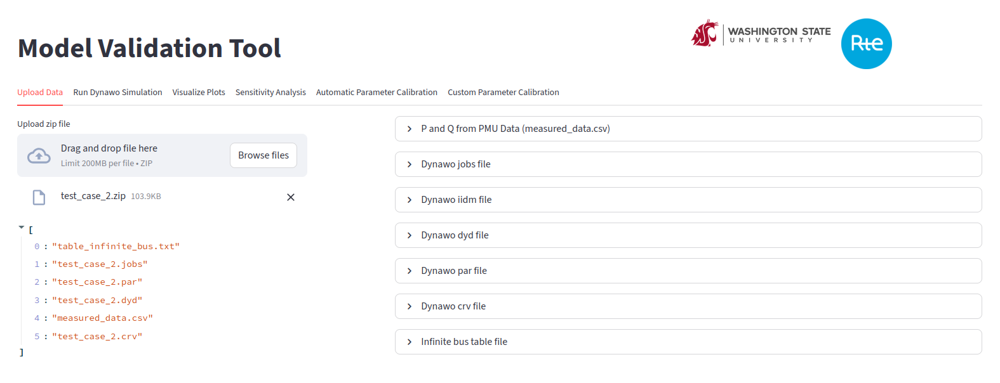

<!-- 
    # Copyright (c) 2022-2025, RTE (http://www.rte-france.com)
    # See AUTHORS.md
    # All rights reserved.
    # This Source Code Form is subject to the terms of the Mozilla Public
    # License, v. 2.0. If a copy of the MPL was not distributed with this
    # file, you can obtain one at http://mozilla.org/MPL/2.0/.
    # SPDX-License-Identifier: MPL-2.0
    # This file is part of the dynamic-model-validation-engine project.
-->

# Dynawo Model Validation Toolbox

This Python toolbox is designed to compare the output 
of Dynawo simulations with PMU measurements. 
In case of abnormal differences, a dedicated module 
helps identify the model parameters that are most 
likely erroneous.

## Table of Contents

- [About](#about)
- [Contributors](#contributors)
- [License](#license)
- [Reference paper](#reference-paper)
- [Requirements](#requirements)
- [Installation](#installation)
- [Settings](#settings)
- [How to use](#how-to-use)
- [Getting started](#getting-started)

## About

Transmission System Operators (TSOs) ensure the safe operation of the power system through various daily simulations. The quality of these simulations heavily relies on the accuracy of the models describing the behavior of different assets.

It is crucial for TSOs to validate that the models they use accurately represent the actual behavior of the assets, particularly the generators.

One effective method to achieve this is by utilizing PMU data records to replay past events and compare the simulation outputs against the PMU measurements.

Typically, the test system consists of a generator connected to an infinite bus, where the PMU records (phase and magnitude of the voltage) serve as inputs to the simulation, conditioning the active and reactive power generation of the generator.

In cases where there are significant differences between the P and Q values from the simulation and those from the PMU, the model parameters should be adjusted to calibrate the model to better represent the actual behavior.

The toolbox in this project enables users to:
* Compare the output of a Dynawo simulation against PMU measurements.
* Perform sensitivity analysis to detect the model parameters that are most likely to influence the results.
* Manually calibrate the model parameters.
* Automatically calibrate the model parameters using optimization modules.

## Contributors

This code has been developped by [Washington State University](https://school.eecs.wsu.edu/)
and [RTE](https://www.rte-france.com/) (French Transmission System Operator).
 
The main contributors are listed in *AUTHORS.md*.

## License

This project and is licensed under the terms of the 
[Mozilla Public License V2.0](http://mozilla.org/MPL/2.0). 
See [LICENSE](LICENSE.txt) for more information.

## Reference paper

More details on the tool and methods used can be found in the following reference:
```
S. Ghimire, V. M. Venkatasubramanian and G. Torresan, 
"Analysis of Optimization Algorithms for Multiple Parameter Estimation in Model Validation Problems," 
2023 North American Power Symposium (NAPS), 
Asheville, NC, USA, 2023, pp. 1-6, 
doi: 10.1109/NAPS58826.2023.10318793.
```

## Requirements

* Python >= 3.8.10

## Installation

The package and its dependencies should be installed in a python virtual environment. First, create a virtual environment called `venv`:

```bash
python -m venv venv
```

Activate the virtual environment:

```bash
source venv/bin/activate
```

Make sure that `pip` is up-to-date:

```bash
(venv) pip install --upgrade pip
```

Install the necessary libraries:

```bash
(venv) pip install -r requirements.txt
```

## Input data

The toolbox expects a zip file to be uploaded.
This zip file must contain: 
* The input files for Dynawo (job file and associated files) 
* A file named *measured_data.csv* that contains the P and Q
values measured by the PMU.

## Settings

The file `resources/settings.yaml` needs to be updated with the path
to your dynawo exe file.

## How to use

Run the main script:

```bash
streamlit run sources/main_gui_streamlit.py
```

This will open a new tab in your web browser :
 
<p align="center">

</p>

From there, upload the zip file.

Then, navigate to the `Run Dynawo Simulation` tab and click
on the `Run Dynawo Simulation for the base case` button.

Once the simulation has been run, the *simulation* and *measured* 
plots will be available in the `Visualize plots` tab.

If they do not match well, it is advised to run a sensitivity 
analysis to identify the parameters that are the most likely to 
be erronous. Go to the `Sensitivity Analysis` tab, select the 
parameters to consider, then click the `Run Sensitivity Analysis` button.
A sorted table on the right will highlight the parameters that 
are most likely to need calibration.

The next step is to run the automatic calibration.
Move to the `Automatic Parameter Calibration` tab, then select the 
parameters to calibrate, choose the optimization engine, 
and click on the `Run Calibration` button.
New plots will be displayed in the `Visualize Plots` tab.  
**It is strongly advised to limit the number of parameters
to calibrate to a small number.**

Finally, you can use the `Custom Parameter Calibration` tab 
to manually modify the model parameters and observe
their effect in the `Visualize Plots` tab.

## Getting started

Two dummy examples are provided in the `test_cases` directory. 

For each example, a Dynawo simulation was run using a defined set of generator parameters. 
Afterwards, some of these parameters were manually modified. 
The objective is to use the toolbox to identify which parameters were changed.  
